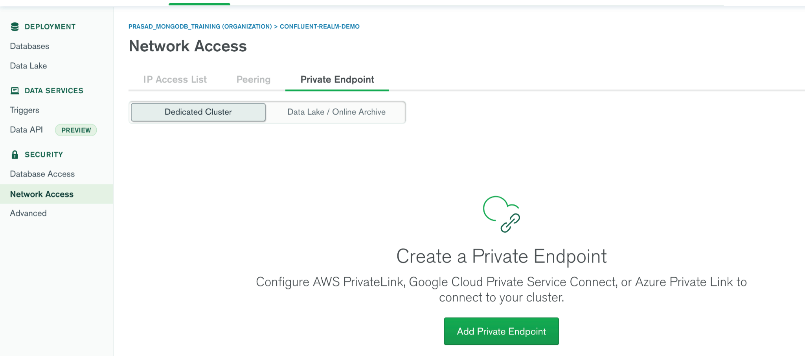
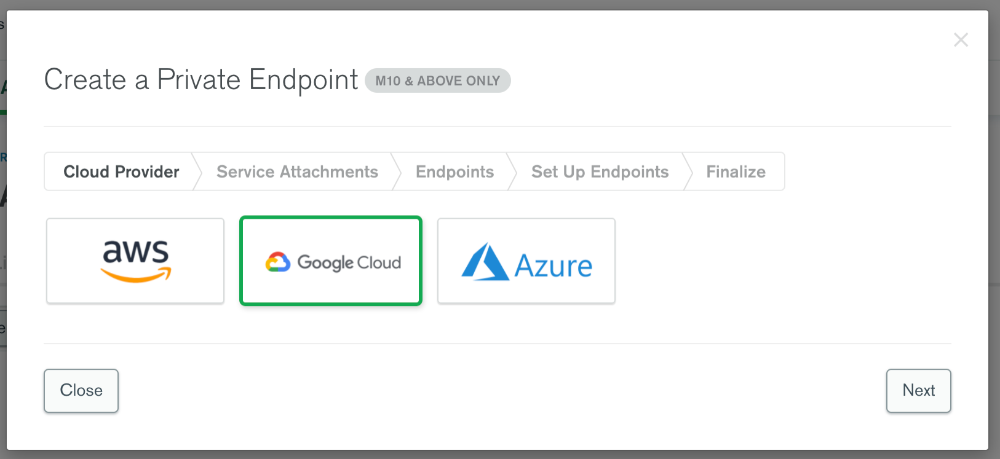
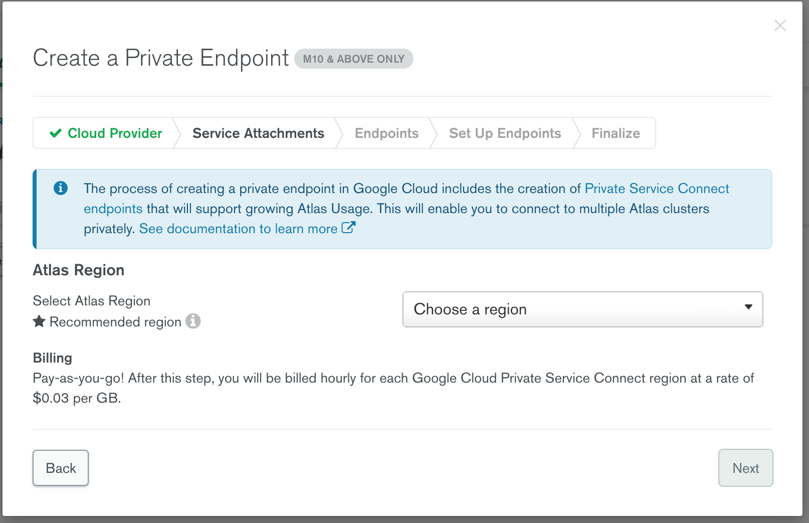
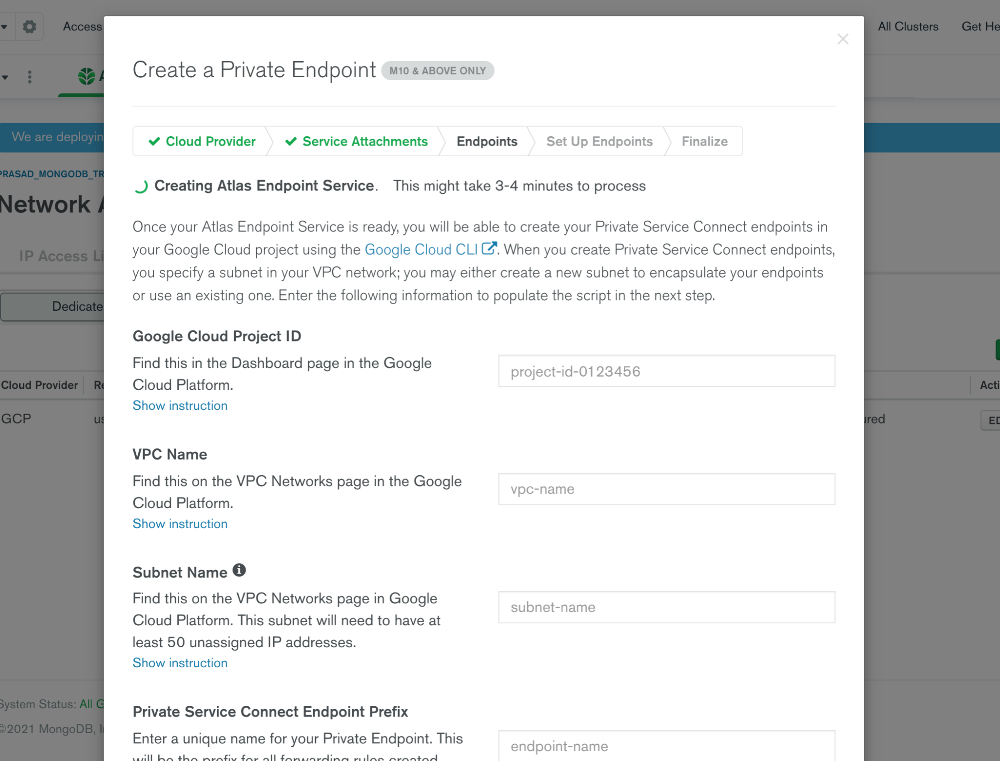
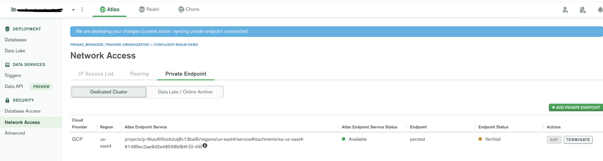
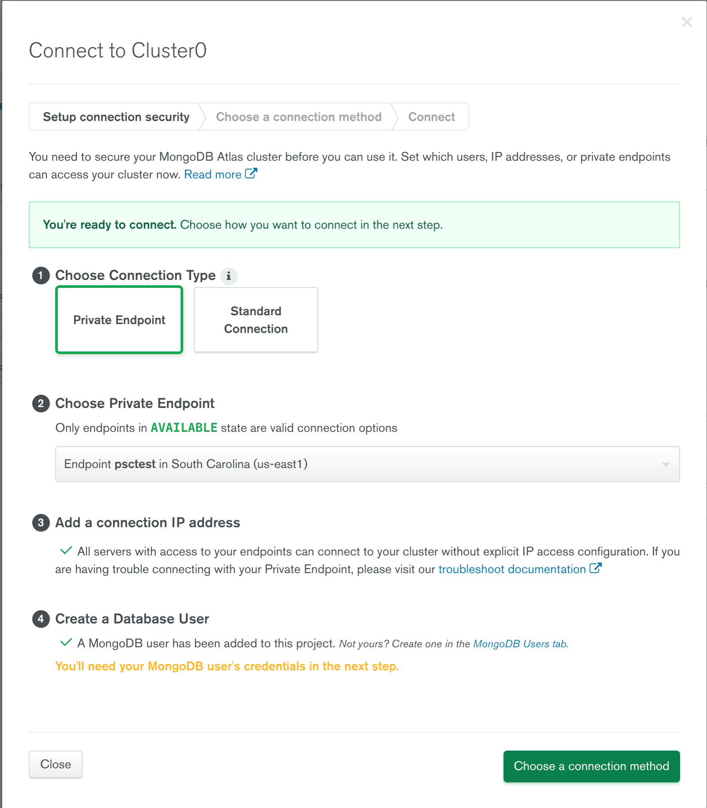
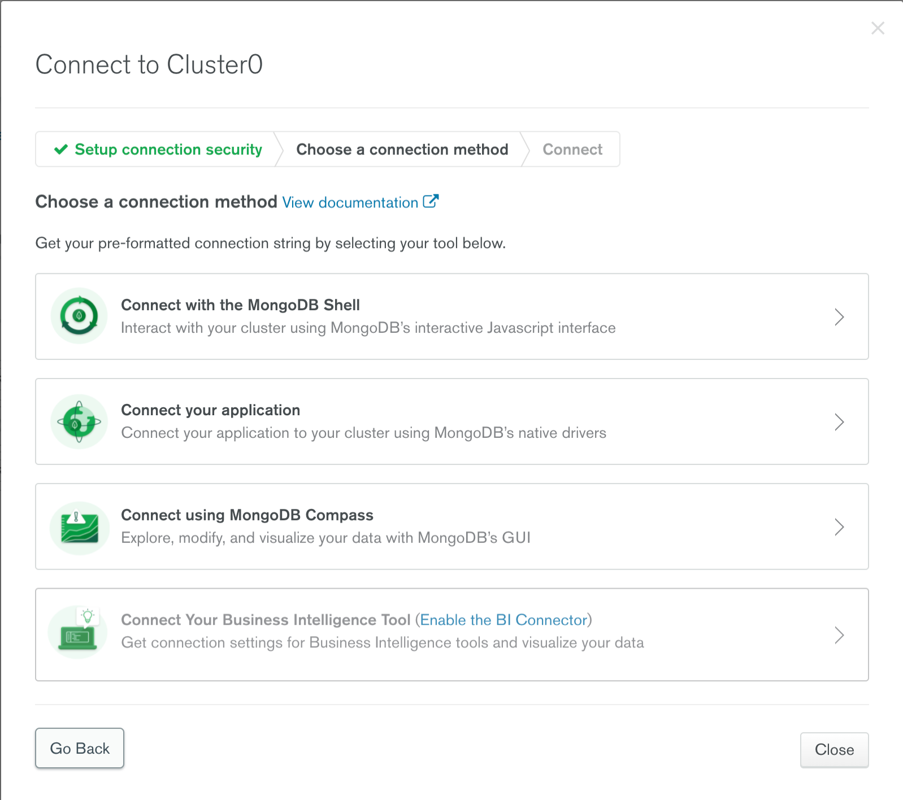
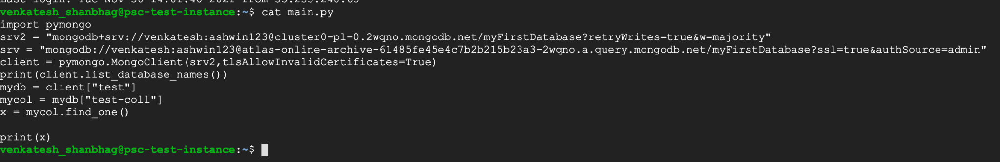
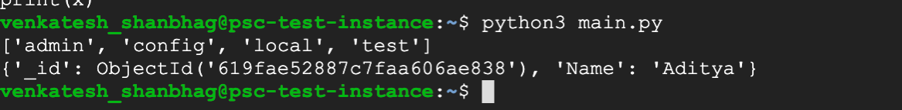

# Connecting Google Private service connect with MongoDB atlas.
**MONGODB INC. INTERNAL ONLY - DO NOT PROVIDE THIS PROJECT'S CONTENT DIRECTLY TO PROSPECTS, CUSTOMERS OR THE PUBLIC COMMUNITY**

### Pre-requisites for PoV:

GCP:
1. Access to GCP console with permissions to add/update VPC network to
Create a subnet with at least 50 free IP addresses.
2. Enable the API for Service Directory by navigating to GCP console -> Network services -> Service Directory.

MongoDB:
1. Admin Access to MongoDB Atlas to create a MongoDB cluster with cluster tier M10 or higher. (Please use GETATLAS to get free credits for running the PoV). 

**Note**: The Private Endpoints are available only for dedicated clusters i.e. M10 or higher.

Atlas PSC setup for **Replica set**:
1. Log-on to your Atlas account and navigate to your project.
2. Create a Dedicated cluster with tier M10 or above. Do not enable sharding for this cluster if using M30+ clusters. Ensure you are using MongoDB version 4.x+ for this PoV.
3. In the project's Security tab, choose to add a new user, e.g. adminuser, and for User Privileges specify Read and write to any database (make a note of the password you specify).
4. We are not using any external IP address. We don't need to whitelist any IP address as such. (In shared project - Do not delete any ip whitelisted). 
5. Navigate to **Private Endpoints** tab in **Network Access** and click on Add Private endpoint.  
    ><
    
    Select Google Cloud and Click Next.
    
    Choose a region. (Preferably : The region should be same as the region of the Application)
    
    Once you create Next the private endpoints will get created.
    
    Once your Atlas Endpoint Service is ready, you will be able to create your Private Service Connect endpoints in your Google Cloud project using the Google Cloud CLI . When you create Private Service Connect endpoints, you specify a subnet in your VPC network; you may either create a new subnet to encapsulate your endpoints or use an existing one. Fill in your GCP project and VPC details (Read through the instructions by expanding the instructions on the same page).
6. Install [gcloud](https://cloud.google.com/sdk/docs/install) command line utility on your workstation. (Note: You need to have permission )
7. Copy the commands from popup on Atlas and save it as shell script and run using the shell command.
8. Once the script completes running it will generate a Json file in the same location with name atlasEndpoints-<name of your psc>.json
9. Upload the file using Upload file button on Next screen. 
10. Wait and check for the Endpoint status to change to Completed.


Atlas creates 50 service attachments for your google private service connect private endpoint. Each endpoint provided is attached to service attachment to enable private connectivity.

###Connect to Atlas using Private endpoints:
Note: You must have the MongoDB database in GCP and region must be same as that of the PSC we have created.

The **Private Endpoint** option will be added to your connection type if the creation of the PSC was successful.



Choose **private endpoint** and click on Choose a connection method.



### Connecting to Atlas from a google compute instance using PSC:
1. Create a VM instance satisfying one of the below cases.

#### Cases:
* **Same VPC same subnet:** Accessible. 
* **Same VPC different subnet same region:** Accessible.
* **Same VPC different subnet different region:** Not accessible.
* **Different VPC:** Not accessible  (on both internal IP only and with external IP).

2. SSH into the VM instance and install python dependencies from _requirements.txt_ file. 
```pip3 install -r requirements.txt. ``` 

3. Once the requirements are installed edit the VM and disable the ephemeral ip from network tab. 
4. Run the python script to connect to MongoDB atlas and access the data.
```python3 run-mongo-script.py```



   


### Execution:
Run python script "run-mongo-script.py" to connect and test the connection from VM to MongoDB Atlas using GCP-PSC. 

### Results:
You  should be able to connect to the MongoDB Cluster using MongoDB client installed on the VM instance and read documents from the cluster without using external IP (Disable the ephemeral IP address on the VM).

### Conclusion
